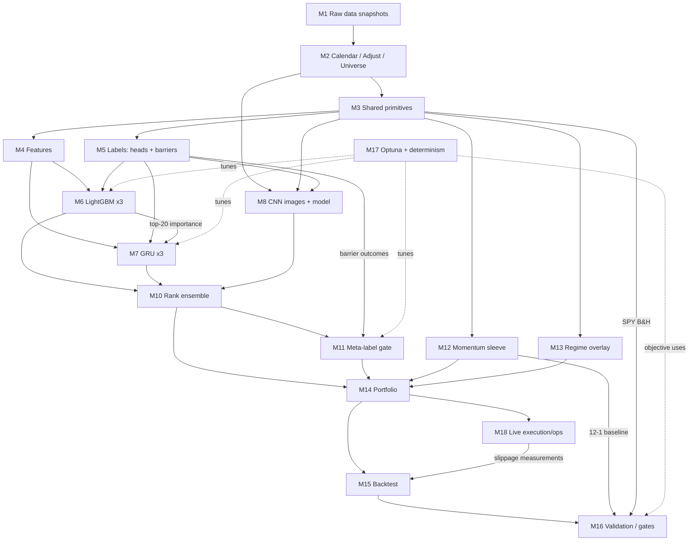

# EOD Swing & Position Trading System — Implementation Blueprint & Coding Rules v1.0.1

**Derived from:** *Stock-Price Prediction Algorithms for EOD Swing & Position Trading — v2.1 (Verified, Corrected, Expanded & Gap-Audited)*
**Status:** Implementation-ready. Every numeric value is traceable to v2.1. Anything the spec left open is tagged `[IMPL]` and registered in §10 (Deviation & Decision Log) so it can be audited — **nothing in v2.1 has been altered or overridden.**
**Date:** 2026-07-17

**Changelog v1.0 → v1.0.1 (verification audit — no spec value changed):** FINRA 6%-of-total-trades nuance + cash-account note (G-14); economic-priors screen (G-09, §16.3); scope-note examples (G-13); GC borrow range (§3, M18); trailing-vol estimator alternative (§3/BP14); JKX monthly-headline/VW/vol-comparison/international context (M8); GKX & Sharpe-loss documented-results context (M9.1–9.2); long-horizon-forecaster note (M9.4); §16.4 anchors expanded to the full current qlib README row set with the anomalous DoubleEnsemble row identified and a close-dealt-backtest caveat; DSR conventions + calibration note (§16.2); %B equivalence (F5); WorldQuant attribution (F10); turnover-penalty phrasing (M14); [IMPL] register completed (rows 26–30, rows 23/25 amended). Companion: *blueprint_verification_report_v1.md*.

---

## §0. How to Read This Document

- **Rule levels:** `[MUST]` = non-negotiable, violating it invalidates results. `[SHOULD]` = default behavior, deviate only with a logged reason. `[MAY]` = optional, spec-sanctioned extension. `[IMPL]` = implementation decision the spec did not pin down; the chosen default is stated, is consistent with the spec, and is listed in §10.
- **Rule IDs:** `G-xx` = global invariants (§1). `M<n>-xx` = rules belonging to module `M<n>` (§4). `Q-xxx` = calculated quantities in the master inventory (§5). `C-xx` = calculation clubbing groups (§5.2). `T-xx` = mandatory tests (§9).
- **Source anchors:** `(§A)…(§K)`, `(TLDR)`, `(KF#)` = Key Finding #, `(BP#)` = Build Plan step #, `(GNG)` = go/no-go block, `(CAV)` = caveats — all referring to sections of the v2.1 research spec.
- **The DAG (§2) is the contract.** A module may only read the outputs of modules upstream of it. Any new edge requires a leakage review (T-02).
- Code targets: Python ≥3.11, LightGBM, PyTorch, qlib, vectorbt + an event-driven engine (zipline-reloaded / backtrader / NautilusTrader), Optuna, ib_async (§J). GPU assumed available; **no design decision below is compromised for compute** (per project constraint).

---

## §1. Global Invariants (apply to every module, every line of code)

**G-01 [MUST] Cross-sectional framing.** All primary ML signals predict *relative* outcomes across the universe (which stocks beat which), never absolute single-stock price levels. Model targets, metrics, and portfolio construction are all cross-sectional. (TLDR, KF1)

**G-02 [MUST] One-day signal lag — the label convention.** A signal computed from data up to close *t* may only earn returns starting at the **open of t+1**. The canonical label at horizon *n* (qlib convention generalized, §E):

```
y_n(t, i) = AdjClose_{t+1+n, i} / AdjClose_{t+1, i} − 1
```

No label, feature target, or backtest fill may ever reference the same close that generated the signal. This is enforced structurally (labeler owns the shift) and by tests T-01/T-09. Backtests use **open-to-open returns with the one-day lag**; vectorbt's same-close defaults are explicitly overridden. (§E, §H)

**G-03 [MUST] Two price worlds, never mixed.** (§F price-data hygiene)
- `adj_*` tables: split- **and** dividend-adjusted (total-return) OHLCV → used for **all** features, labels, vol estimates, analytics, model inputs.
- `raw_*` tables + `corporate_actions` table: unadjusted prices → used **only** for share-quantity computation, order generation, broker reconciliation, and tax lots.
Naming convention is mandatory (`adj_close` vs `raw_close`); no function accepts both kinds in one argument.

**G-04 [MUST] EOD-only pipeline.** Signals are computed once per day after the close from data ≤ close *t*. No intraday features, no intraday signal recomputation. Entries and time-based exits execute as **MOO at next open**; the only intraday events are resting barrier orders (profit-take limit / stop) placed at entry per §G — which is exactly how a same-day exit (incl. same-day short cover) legitimately occurs. (§G, §H, project constraints)

**G-05 [MUST] Universe discipline.** Liquid US large/mid-cap: historical S&P 500 constituents **or** top ~1,000 by dollar volume; survivorship-bias-free (delisted names included with real delisting returns); microcaps excluded. Universe membership is a dated mask applied *before* any cross-sectional operation. (BP1, §H biases)

**G-06 [MUST] Purged validation only.** Random k-fold on time series is forbidden. Every train/test split — walk-forward, CPCV, and every Optuna objective evaluation — applies **purging** (drop training samples whose label window overlaps test) **plus a 21-day embargo** after test blocks. CPCV configuration is fixed: **N=6 groups, k=2 → 15 splits, 5 backtest paths.** A final untouched hold-out segment is reserved and opened once. (§G)

**G-07 [MUST] Cost realism everywhere.** All reported performance is net of: per-trade cost (Stage-1 anchor **15 bps/trade**, sensitivity grid **5–30 bps**), slippage (initially 0, replaced by measured open-print slippage from paper trading), short borrow (**~50 bps/yr** general collateral; per-name table for hard-to-borrow), and dividend liability on shorts. One cost-model implementation serves backtests, baselines, meta-labeling outcomes, and live estimation. (§H, BP5)

**G-08 [MUST] Baseline discipline.** Every candidate model/book is benchmarked against (a) **SPY buy-and-hold** and (b) a **plain 12-1 momentum decile strategy** on the same universe, net of the same costs; report alpha/beta against both. **A model that can't beat both free baselines does not ship.** (BP6, project constraint)

**G-09 [MUST] Multiplicity accounting.** Every configuration ever evaluated — manual runs, CPCV splits' model selections, and **every Optuna trial (budget ≤100 per model)** — is written to a trials ledger and counted in the **Deflated Sharpe Ratio**. Statistical defenses are paired with **economic priors** (§H): every candidate signal SHOULD carry a one-line stated economic rationale; rationale-free features that only appear post-search are treated as overfitting suspects first. (§G, §H, §J)

**G-10 [MUST] Reproducibility.** Fixed seeds for Python/NumPy/PyTorch/LightGBM; `torch.use_deterministic_algorithms(True)`, `cudnn.deterministic=True`, `cudnn.benchmark=False`; LightGBM `deterministic=true, force_col_wise=true, seed=<s>`. Every artifact is stamped with `(config_hash, data_snapshot_id, git_sha, seed)`. Two identical runs must produce bit-identical metrics (T-07). (§J)

**G-11 [MUST] Go/no-go gates.** (GNG)
- **Kill:** net-of-cost walk-forward Rank IC < ~0.02 **or** net Sharpe < ~0.5 → do not trade.
- **Advance to paper:** net Sharpe ≥ ~0.8 **and** max drawdown < ~15% across multiple CPCV paths **and** outperformance of both G-08 baselines.
- **Decay/retire:** live or paper Sharpe < ½ backtest for 2+ quarters → retrain or retire.
- **Sanity ceiling:** realistic live expectation is net Sharpe 0.7–1.2, high-single-digit to mid-teens annual return, 10–20% MDD. Any backtest with net Sharpe > 2.0 or MDD < 5% triggers a mandatory leakage audit before anyone celebrates `[IMPL threshold, from GNG "materially better = leakage/cost-neglect until proven otherwise"]`.

**G-12 [MUST] Metric hierarchy.** Judge by net, cost-inclusive, out-of-sample Sharpe / drawdown / Rank IC — never by accuracy. ~52–55% cross-sectional directional accuracy is what winning looks like. (TLDR, §H)

**G-13 [MUST] Scope exclusions.** No intraday microstructure signals or intraday execution algos beyond MOO + resting barrier orders; no options/derivatives beyond the index hedge (SPY/ES); no exotic alt data (e.g., satellite imagery, card-panel data). These absences are decisions, not omissions; each can be bolted on later without changing the core architecture. (Scope Notes)

**G-14 [MUST] Regulatory & tax accounting built-in.** PDT counter (same-day round trips, incl. same-day short covers) enforced in live order generation and simulated in backtests when configured equity < $25k (limit ≤3 per rolling 5 business days). FINRA's trigger is technically ≥4 day trades within 5 business days *when they also exceed 6% of total trades in that window*; the flat ≤3 budget ignores the 6% carve-out and is therefore strictly conservative `[IMPL simplification]`. Shorting requires margin, so a cash account is **not** a PDT workaround (§I). All holds ≤ 1 year are short-term gains at ordinary rates: the evaluation module reports **after-tax Sharpe** alongside pre-tax, using a user-supplied marginal rate. (§H, §I)

**G-15 [MUST] Single implementation of shared logic.** The triple-barrier engine, cost model, cross-sectional rank/normalize transform, purge/embargo splitter, and EWMA-vol estimator each exist exactly once in the codebase and are imported by every consumer (labeler, backtester, live engine, baselines). This is the structural defense against train/backtest/live skew. `[IMPL — engineering rule enforcing §G's "the same three barriers are the exit rules"]`

**G-16 [MUST] Decay is assumed.** Default retraining cadence: monthly for LightGBM/GRU/meta-model; the CNN may be trained once (JKX evidence: worked ~19 years) with optional annual refresh `[MAY]`. Signal-health monitoring per G-11 decay rule runs continuously. (§G, CAV)

**G-17 [SHOULD] 2-day holds are cost-hostile.** No deliberate short-horizon book exists; sub-5-day holds arise only from barrier stops/profit-takes, and any *intentional* fast trade requires top-quantile ensemble rank **and** meta-gate pass at an elevated threshold (§4/M11). (§H)

---

## §2. System Architecture — Layers, Modules, and the Computation DAG

### 2.1 Layered module map

| Layer | Module | Name | One-line responsibility |
|---|---|---|---|
| L0 | M1 | Data Ingestion & Storage | Pull & snapshot raw vendor data (prices, actions, PIT fundamentals, constituents, earnings, news, index). |
| L1 | M2 | Calendar, Adjustment, Universe | Trading calendar; adjustment factors → `adj_*` tables; dated universe mask; data-health checks. |
| L2 | M3 | Shared Primitives | Returns, rolling-stat engine, EWMA-vol family, forward-return engine, cross-sectional transform, monthly return grid, index block. |
| L3 | M4 | Feature Engineering | Alpha158-style blocks + fundamentals + event + NLP (+ optional 101 Alphas) → normalized feature matrix. |
| L3 | M5 | Labeling | Horizon-head labels (5/20/60d, lagged, CS-demeaned) + triple-barrier labels. |
| L4 | M6 | LightGBM heads | Primary tabular ranker ×3 horizons. |
| L4 | M7 | GRU heads | Sequence model ×3 horizons on top-20 LGBM features. |
| L4 | M8 | CNN chart-image signal | JKX image generation + VGG-style CNN (I5/I20/I60, R20 supervision). |
| L4 | M9 | Optional models | GKX feed-forward NN; Sharpe-loss net; 101-Alphas pruning; DoubleEnsemble/TRA experiments. |
| L5 | M10 | Ensembling | Per-day ranks per model/head → blended ensemble rank. |
| L5 | M11 | Meta-labeling | Secondary LGBM on barrier outcomes → P(profit) gate + size multiplier. |
| L5 | M12 | Classical sleeve | 12-1 vol-scaled overlapping momentum (6–12m sleeve); optional pairs; optional TSMOM. |
| L5 | M13 | Regime overlay | 200d-MA / realized-vol filter (default) or 2–3-state Gaussian HMM (option) → gross-exposure multiplier. |
| L6 | M14 | Portfolio Construction | Decile selection, tranches, inverse-vol weights, caps, vol targeting, no-trade bands, index hedge, sleeve budgets. |
| L7 | M15 | Backtest Engine | vectorbt fast path + event-driven confirmation; lag enforcement; cost/borrow/PDT/tax simulation. |
| L7 | M18 | Execution & Live Ops | MOO order generation (IBKR), resting barrier orders, slippage measurement, health checks, kill switch, reconciliation, logging, decay monitor. |
| L8 | M16 | Validation & Evaluation | Purged WF, CPCV(6,2), IC/RankIC/ICIR, net & after-tax Sharpe, MDD, turnover, DSR, baselines, gates. |
| X | M17 | HPO & Reproducibility | Optuna (≤100 trials/model), purged objectives, trials ledger, determinism harness. |

### 2.2 Computation DAG (module level)



Key structural edges to respect:

1. **M6 → M7** (LightGBM feature-importance ranking selects the GRU's ~20 inputs, BP8) — GRU training cannot start before an LGBM fit exists for the same walk-forward fold.
2. **M5 barrier outcomes → M11** — the meta-model trains on triple-barrier trade outcomes of the *primary* signal, so M11 requires a frozen M10 for each fold.
3. **M18 → M15 feedback** — measured open-print slippage updates the backtest cost model (paper-trading loop, §H).
4. **M12 is dual-use** — the same 12-1 momentum computation is (a) a feature (M4), (b) the live 6–12-month sleeve, and (c) the mandatory free baseline (M16). One implementation, three consumers (C-09).
5. **M17 sits outside the data path** — it may only call M16's purged objective; it never touches test folds directly.

### 2.3 Daily production sequence (live, after close t)

```
1. M1 incremental pull → M2 health checks (block on failure) → adj/raw updates, universe mask for t
2. M3 primitives update (returns, EWMA σ, rolling stats, index block)
3. M4 features(t) → M8 images(t)
4. Model inference: M6, M7, M8 → per-head scores(t)
5. M10 ranks & blend → ensemble_rank(t)
6. M11 meta P(profit | side, context)(t)
7. M13 regime multiplier(t); M12 sleeve targets (monthly step only)
8. M14 target portfolio(t+1 open): tranche refresh, weights, caps, vol target, hedge, bands
9. M18: diff vs current book → MOO orders (+ barrier orders for new entries), PDT check, submit before cutoff
10. Next morning: fills @ open t+1 → slippage vs official open print → M18 logs → M15 cost model update queue
```

---

## §3. Configuration Registry

One YAML file (`configs/system.yaml`) is the single source of truth; its SHA-256 is the `config_hash` stamped on every artifact. Defaults below are the spec's values; where the spec gives a range, the default sits inside it and search is confined to that range. `req` = user must set explicitly before live.

### 3.1 Data & universe

| Key | Default | Allowed / notes | Source |
|---|---|---|---|
| `universe.mode` | `top1000_dollar_volume` | or `sp500_historical` | BP1 |
| `universe.size` | 1000 | ~1,000 (or S&P 500 membership) | BP1 |
| `universe.liquidity_window_days` | 63 | median daily dollar volume window `[IMPL]` | BP1 |
| `universe.refresh` | monthly | with 10% entry/exit hysteresis buffer `[IMPL]` | BP1 |
| `universe.min_price` | 5.0 USD | microcap/penny exclusion `[IMPL]` | BP1 |
| `universe.min_mcap` | 300e6 USD | `[IMPL]` — microcaps excluded per spec | BP1 |
| `data.vendors` | sharadar+eodhd | EODHD / Nasdaq-Sharadar / Polygon / Tiingo; PIT fundamentals + delisted names mandatory | §J |
| `data.index_symbol` | SPY | hedge/regime/baseline instrument (ES optional for hedge) | §I, BP7 |
| `data.snapshot_immutable` | true | raw pulls are append-only, versioned | G-10 |

### 3.2 Labels & barriers

| Key | Default | Allowed / notes | Source |
|---|---|---|---|
| `labels.horizons` | [5, 20, 60] | trading days; optional extra head 120–250 `[MAY]`, expect weaker IC | §F, BP4 |
| `labels.lag_days` | 1 | **fixed** — do not expose for tuning | G-02 |
| `labels.cs_norm` | demean | {demean, rank, zscore}; regression on demeaned preserves magnitude for sizing | §F |
| `labels.task` | regression | {regression, top_vs_bottom_tercile_classification} — tunable choice, mixed evidence | §F |
| `barrier.m` | 1.5 | ∈ [1, 2] | §G, BP12 |
| `barrier.h_days` | 20 | max hold; vertical barrier | §G, BP12 |
| `barrier.sigma_span` | 32 | EWMA span ∈ [20, 60]; span 32 ≡ λ=0.94 → shared with sizing σ (C-02) | §G, BP14 |
| `barrier.tie_break` | stop_first | if both barriers inside one daily bar, assume stop hit first (conservative) `[IMPL]` | §G |

### 3.3 Models

| Key | Default | Allowed / notes | Source |
|---|---|---|---|
| `lgbm.objective` | mse | {mse, lambdarank} | BP3, §F |
| `lgbm.learning_rate` | 0.1 | search ∈ [0.05, 0.2] `[IMPL midpoint default]` | BP3 |
| `lgbm.num_leaves` | 210 | ~210 | BP3 |
| `lgbm.max_depth` | 8 | | BP3 |
| `lgbm.colsample_bytree` | 0.8879 | | BP3 |
| `lgbm.subsample` | 0.8789 | | BP3 |
| `lgbm.lambda_l1` | 205.7 | ≈205.7 | BP3 |
| `lgbm.lambda_l2` | 581.0 | ≈581 | BP3 |
| `lgbm.num_boost_round` | 1000 | with `early_stopping_rounds=50` | BP3 |
| `lgbm.deterministic` | true | + `force_col_wise=true`, fixed `seed` | G-10 |
| `gru.hidden_size` | 64 | | BP8 |
| `gru.num_layers` | 2 | | BP8 |
| `gru.dropout` | 0.2 | | BP8 |
| `gru.lr_schedule` | 1e-3 → 1e-4 | Adam; ÷10 on valid-RankIC plateau (patience 3) `[IMPL schedule shape]` | BP8 |
| `gru.lookback` | 60 | days | BP8 |
| `gru.n_features` | 20 | top-k by LightGBM gain importance | BP8 |
| `gru.batch_size` | 2048 | `[IMPL]`; sequences grouped by date for CS labels | BP8 |
| `cnn.image_days` | [5, 20, 60] | image sizes 15×32 / 60×64 / 180×96 (W×H) | §C |
| `cnn.supervision_horizon` | 20 | R20; label = 1[y_20 > 0] with G-02 lag | §C, BP9 |
| `cnn.blocks` | {5:2, 20:3, 60:4} | conv(5×3)→BN→LeakyReLU(0.01)→2×1 maxpool | §C |
| `cnn.base_filters` | 64 | doubling per block 64→128→256→512 (**use 64, not the caption's 32**) | §C |
| `cnn.optimizer` | adam, lr=1e-5 | batch 128, Xavier init, 50% FC dropout, early-stop patience 2 | §C |
| `cnn.n_retrainings_avg` | 5 | average forecasts over 5 retrainings | §C |
| `cnn.train_policy` | train_once | annual refresh `[MAY]`; JKX held ~19y | §C, §G |
| `cnn.deploy_config` | I5_R20_quarterly | cost-realistic target: ~60%/month turnover, H-L Sharpe ~1.3 expectation | §C, KF4, BP9 |
| `gkx_nn.enabled` | false | reference model, §4/M9 | §A |
| `sharpe_net.enabled` | false | Stage-2 option, §4/M9 | §D, BP11 |
| `alphas101.enabled` | false | Stage-2 option; prune by validation Rank IC | §F |

### 3.4 Ensemble, meta, sleeves, regime

| Key | Default | Allowed / notes | Source |
|---|---|---|---|
| `ensemble.method` | mean_rank | average per-day cross-sectional ranks (DoubleEnsemble = proof of concept) | BP8 |
| `ensemble.members` | lgbm_h{5,20,60}, gru_h{5,20,60}, cnn_I5R20 | equal weights default `[IMPL]`; weights tunable via M17 (counted in DSR) | BP7–9 |
| `meta.enabled` | true (Stage 3) | | BP12 |
| `meta.p_threshold` | 0.55 | start ~0.55; search [0.50, 0.65] `[IMPL range]` | §G |
| `meta.sizing` | prop_p_minus_half | size ∝ (p − 0.5), capped by vol-target rules | §G |
| `meta.adoption_gate` | turnover↓ material at ≥ net Sharpe | required before adopting | BP12 |
| `mom_sleeve.formation` | 12-1 | 12-month formation, skip most recent month | §K, BP10 |
| `mom_sleeve.K_holding_months` | 12 | J,K ∈ {3,6,9,12}; overlapping 1/K tranches; K=12 stretches holds toward 1y (tax tilt) `[IMPL default within §K]` | §K |
| `mom_sleeve.long_only` | true | long-only tilt mitigates ST-tax drag `[SHOULD]`; L/S `[MAY]` | §K |
| `mom_sleeve.vol_target` | 0.12 | Barroso–Santa-Clara scale = 12% / σ̂(6-month strategy vol) | §K |
| `mom_sleeve.scale_cap` | 2.0 | leverage cap on the scale factor `[IMPL]` | §K |
| `mom_sleeve.risk_budget` | 0.30 of gross | own risk budget beside ML book `[IMPL default]` | BP10 |
| `pairs.enabled` | false | §K spec if enabled: GGR + modern cointegration variant | §K |
| `tsmom.enabled` | false | only if extending to ETFs/futures | §K |
| `regime.mode` | ma200_vol | or `hmm` | BP13, §K |
| `regime.vol_threshold_ann` | 0.25 | 21-day realized index vol, annualized `[IMPL — "set threshold" left open]` | BP13 |
| `regime.gross_multiplier_risk_off` | 0.5 | halve gross exposure | BP13 |
| `hmm.n_states` | 2 | 2–3 Gaussian states on index returns/vol | §K |

### 3.5 Portfolio, costs, execution, compliance

| Key | Default | Allowed / notes | Source |
|---|---|---|---|
| `port.selection` | top_decile_long | hedged long-only default; short bottom decile `[MAY]` if borrow economics allow | BP7, §I |
| `port.hedge` | short_SPY_beta_matched | or ES futures | §I, BP7 |
| `port.tranches` | 15 | daily-staggered; Stage-1 fixed hold = 15 sessions → ~10–20d avg holds; Stage 3: barrier exits (h=20) supersede fixed exit `[IMPL count within target]` | BP7, §H |
| `port.weighting` | inverse_vol | 1/σ; `size.vol_estimator: ewma_span32` (default) **or** `realized_20_60d` trailing realized vol `[MAY]` | BP14 |
| `port.single_name_cap` | 0.03 | ∈ [0.02, 0.05] `[IMPL midpoint]`; overnight-gap defense | BP14, §H |
| `port.vol_target_ann` | 0.12 | ∈ [0.10, 0.15] | BP14 |
| `port.no_trade_band` | 0.20 | skip if |Δw| < 20% of target weight or < 10 bps NAV `[IMPL]` | BP14 |
| `cost.per_trade_bps` | 15 | Stage-1 reporting anchor; sensitivity {5, 15, 30} | BP5, §H |
| `cost.borrow_gc_bps_yr` | 50 | GC ≈ 0.3–1%/yr historically (50 sits inside); per-name HTB override table (5–100%+ possible) | §H, §I |
| `cost.slippage_bps` | 0 → measured | replaced by paper-trading open-print measurements | §H |
| `exec.order_type` | MOO | submitted post-close, respecting exchange pre-open cutoff | §H |
| `exec.broker` | IBKR (ib_async) | | §H, §J |
| `exec.barrier_orders` | stop + limit, GTC | placed at entry for barrier exits; vertical exit via MOO | §G, G-04 |
| `pdt.account_equity` | req | if < 25_000: enforce ≤3 same-day round trips / rolling 5 business days | §I |
| `pdt.mode_under_25k` | defer_to_next_open | when budget exhausted, convert same-day exit to next-open MOO + alert `[IMPL]` | §I |
| `tax.ordinary_rate` | req | after-tax Sharpe reporting; all holds ≤1y are short-term | §H |
| `ops.max_daily_loss_pct` | 0.02 | kill switch: halt new orders, alert; flatten policy configurable `[IMPL value — "kill switch" required, level open]` | BP16 |

### 3.6 Validation & HPO

| Key | Default | Allowed / notes | Source |
|---|---|---|---|
| `val.scheme` | purged_walk_forward | train ~5y / valid ~2y / step 1y `[IMPL step]`; alt: FK template 750/250 step 250 | BP5, §B |
| `val.embargo_days` | 21 | ~21-day embargo | §G |
| `val.cpcv` | N=6, k=2 | 15 splits, 5 paths; purge+embargo at every boundary | §G |
| `val.holdout` | final segment, untouched | opened once, at the very end | §G |
| `val.retrain_cadence` | monthly | GBDT/NN; CNN exempt (train-once) | §G |
| `val.metrics` | IC, RankIC, ICIR, net Sharpe, after-tax Sharpe, MDD, turnover, DSR, α/β vs baselines | on open-to-open net returns | BP5, G-08 |
| `hpo.engine` | optuna | objective = purged-CV Rank IC **or** net Sharpe | §J |
| `hpo.max_trials_per_model` | 100 | ≤100; all trials → DSR ledger | §J |
| `seed.global` | 20260717 | `[IMPL value]`; propagated everywhere | G-10 |

---

## §4. Module Specifications

Each module card: **Inputs → Outputs → Rules → Calculations → Feeds into.** Formulas use per-name notation `X_{t,i}`; cross-sectional ops are per-day across the universe mask.

---

### M1 — Data Ingestion & Storage (L0)

**Inputs:** vendor APIs/files (EODHD, Sharadar, Polygon, Tiingo — §J). **Outputs:** immutable raw snapshot tables.

**Storage schema `[IMPL]`** — long format, Parquet, partitioned by date; primary key `(date, ticker)`; entity master keyed by permanent id (Sharadar `permaticker`-style) to survive ticker changes.

| Table | Columns (minimum) |
|---|---|
| `raw_prices_eod` | date, ticker, open, high, low, close, volume, vwap?, close_unadj_flag |
| `corporate_actions` | date, ticker, action_type{split,div_cash,div_stock,spinoff,delist}, ratio, amount, delist_return |
| `fundamentals_pit` | ticker, fiscal_period, report_date, **filing_datetime (as-reported)**, item, value |
| `index_constituents` | date_start, date_end, ticker, index_name (historical S&P 500 / universe lists) |
| `earnings_calendar` | ticker, announce_datetime (before/after-market flag), eps_actual, eps_consensus, est_stddev, n_estimates |
| `analyst_estimates` | date, ticker, consensus_fy1_eps, n_ests |
| `news_headlines` | timestamp_utc, ticker(s), headline, source |
| `index_prices` | date, SPY (and ES if used) raw OHLCV + dividends |
| `borrow_fees` | date, ticker, fee_bps_yr (GC default 50 if absent) |

**Rules**
- **M1-01 [MUST]** Snapshots are append-only and versioned (`data_snapshot_id` = pull date + vendor manifest hash). Restatements arrive as *new rows* with their own `filing_datetime`; originals are never overwritten (PIT integrity, §F/§H).
- **M1-02 [MUST]** Delisted names are retained with their final trades and `delist_return` from the vendor. If a delisting return is missing, the name is marked non-tradable on its last date and logged — do **not** silently drop or invent a haircut. (§H survivorship)
- **M1-03 [MUST]** Historical index-constituent membership is stored as dated intervals, never as "current members." (BP1)
- **M1-04 [SHOULD]** Dual-vendor price cross-check on a rotating 5% sample per pull; discrepancy > 25 bps on close → quarantine ticker pending review `[IMPL]`.

**Feeds into:** M2 (everything).

---

### M2 — Calendar, Adjustment Factors, Universe Mask, Health Checks (L1)

**Inputs:** M1 tables. **Outputs:** `trading_calendar`, `adj_prices_eod` (adjusted OHLCV + total-return close), `adjustment_factors`, `universe_mask(date,ticker)∈{0,1}`, `health_report(date)`.

**Calculations**

- **Q-001 Trading calendar:** NYSE sessions; all "days" in this document are trading sessions on this calendar.
- **Q-002 Adjustment factors (backward, total-return):** for each ticker, cumulative factor `F_t` such that
  `adj_close_t = raw_close_t × F_t`, with `F` stepping at ex-dates: splits multiply by ratio; cash dividends multiply by `(1 − div/raw_close_{exdate−1})`. Apply the same split factor to O/H/L and inverse to volume. Adjusted series therefore embed dividends (total-return) per §F. Recompute the full factor curve on every new action (backward adjustment shifts history — this is why raw tables must exist separately, G-03).
- **Q-003 Universe mask:** per `universe.mode`. For `top1000_dollar_volume`: rank by 63-day median `raw_close×volume` (Q-010), take top `universe.size` at each monthly refresh with hysteresis buffer, then apply `min_price`/`min_mcap` filters; membership applies from the **next session** after the ranking date (no same-day inclusion look-ahead `[IMPL]`). For `sp500_historical`: interval join on `index_constituents`.
- **Q-004 Health report (pre-run, blocking — BP16):** missing bars vs calendar; stale prices (≥5 identical closes); adjusted/raw ratio continuity except at action dates; split sanity (raw jump ≈ action ratio); universe count in expected band; feature-NaN rates < thresholds; duplicate `(date,ticker)`; earnings-calendar coverage of universe; label-alignment spot check (T-01 sample). Any `[MUST]`-level failure blocks signal generation for the day (live) or the run (research).

**Rules**
- **M2-01 [MUST]** All downstream feature/label code reads `adj_*` only; all order/share code reads `raw_*` + actions only (G-03).
- **M2-02 [MUST]** Universe mask is applied before every cross-sectional operation (normalization, ranking, decile cuts, IC). Out-of-universe rows are absent, not zero-filled.
- **M2-03 [MUST]** Fundamentals become visible at `filing_datetime + 1 trading session` (point-in-time lag, §F) — enforced here by publishing a `visible_from` column consumed by M4.

**Feeds into:** M3–M5, M8, M12–M16, M18.

---

### M3 — Shared Primitives (L2) — the clubbing hub

Everything here is computed **once per day for the whole panel** and cached; no downstream module recomputes any of it (C-01…C-05, C-09, C-10).

**Calculations**

- **Q-010 Dollar volume:** `dv_t = raw_close_t × volume_t`; 63-day rolling median for universe (Q-003).
- **Q-011 Daily total return:** `r_t = adj_close_t / adj_close_{t−1} − 1`. Base series for features, vol, labels, momentum, regime, evaluation (C-03).
- **Q-012 Open-to-open return:** `oo_t = adj_open_{t+1} / adj_open_t − 1` (aligned so that a position established at open t+1 earns `adj_open_{t+2}/adj_open_{t+1} − 1` on its first day). Backtest P&L currency (G-02, §H).
- **Q-013 Log returns** `[IMPL]` for vol estimation stability: `lr_t = ln(1 + r_t)`.
- **Q-014 EWMA volatility family (C-02):** `σ²_t = λ σ²_{t−1} + (1−λ) lr_t²` with `λ = 1 − 2/(span+1)`.
  - `sigma32` (λ=0.94, span≈32): **the** shared σ — used by barrier widths (§G), inverse-vol sizing (BP14), and volatility context features.
  - `sigma_h{252}` half-life EWM std: only for the Sharpe-loss net's 5-σ winsorization (§D) — computed only if `sharpe_net.enabled`.
- **Q-015 Rolling-stat engine (C-01):** one grouped pass per window `w ∈ {5, 10, 14, 20, 26, 30, 60}` producing per-name `mean, std, sum, max, min, ema` of the required base columns (`adj_close`, `r`, `volume`, `TR`). Every windowed feature in M4 reads from this cache; adding a new windowed feature means registering `(column, stat, w)` here, not writing a new rolling loop.
- **Q-016 Forward-return engine (C-05):** for `n ∈ labels.horizons` (+120–250 if enabled):
  `fwd_n(t) = adj_close_{t+1+n} / adj_close_{t+1} − 1` (the G-02 lag is baked in **here and only here**; every label consumer imports this function).
- **Q-017 Cross-sectional transform (C-04):** per day, per column, over the universe mask:
  - `rank`: fractional rank mapped to (−0.5, +0.5) `[IMPL default for features — robust]`;
  - `zscore`: winsorize at 1st/99th pct then (x−μ)/σ `[MAY]`;
  - `demean`: x − mean (labels default).
  One function, three modes; also produces model-score ranks in M10 and Spearman inputs for IC in M16.
- **Q-018 Monthly return grid (C-09):** month-end adjusted closes → monthly returns matrix; cumulative `(t−12m, t−1m]` return `mom_12_1 = adj_close_{t−21} / adj_close_{t−252} − 1` (session-count implementation `[IMPL: 21/252 sessions ≈ 1/12 months]`). Consumed by: M4 momentum feature, M12 sleeve, M16 baseline — one computation, three consumers.
- **Q-019 Index block (C-10):** SPY total-return series; `SMA200`; 21-day realized vol (annualized, √252); rolling 60-day beta of each name vs SPY `[IMPL window]` for the beta-matched hedge; HMM inputs.
- **Q-020 True range:** `TR_t = max(adj_high−adj_low, |adj_high−adj_close_{t−1}|, |adj_low−adj_close_{t−1}|)` → feeds ATR (M4) via Q-015.

**Rules**
- **M3-01 [MUST]** Q-016 is the only place `t+1+n` indexing exists for labels. Grep-able invariant: the string `shift(-` appears in M3 and M5 only (T-01 guards).
- **M3-02 [MUST]** Q-014/Q-015 outputs are keyed by `(column, stat, window)`; consumers request by key so identical computations are never duplicated (C-01/C-02).
- **M3-03 [SHOULD]** All primitives computed on the full panel then masked — not per-ticker loops — so cross-sectional ops see a consistent panel.

**Feeds into:** M4, M5, M8 (adjusted OHLCV windows), M12, M13, M14 (σ, β), M15 (Q-012), M16 (baselines, IC inputs).

---

### M4 — Feature Engineering (L3)

**Inputs:** M2 `adj_*`, M3 caches, M1 fundamentals/earnings/news. **Outputs:** `features_norm(date, ticker, ~150+ cols)` + `feature_manifest` (name, formula id, block, windows).

**Implementation path [SHOULD]:** use **qlib's Alpha158 handler** as the tabular core (fastest path per §J), then append the custom blocks below (fundamentals, event, NLP are not in Alpha158). A native reimplementation of the listed blocks is the fallback if qlib's data layer is bypassed. Either way the blocks below are the normative minimum. Total feature count lands at ~150 (TLDR).

**Feature blocks (formulas — all on `adj_*`; all normalized per Q-017 afterward):**

**F1 Price/return (§F):**
- `ret_w = adj_close_t/adj_close_{t−w} − 1`, `w ∈ {1,5,10,20,60}` (doubles as multi-window ROC).
- `co_ratio = adj_close/adj_open`; `hl_ratio = adj_high/adj_low`.
- `range_pos = (adj_close − adj_low)/(adj_high − adj_low)` (close's position in the daily range; 0.5 when H=L `[IMPL]`).

**F2 Moving averages (§F):** `SMA_w`, `EMA_w` for `w ∈ {5,10,20,30,60}` from Q-015, expressed **as ratios**: `adj_close/SMA_w`, `adj_close/EMA_w`.

**F3 Momentum (§F):**
- `mom_12_1` from Q-018 (skip most recent month — reversal contamination guard).
- `RSI_14` (Wilder smoothing, canonical `[IMPL canonical]`): `RSI = 100 − 100/(1+RS)`, `RS = WilderEMA₁₄(gains)/WilderEMA₁₄(losses)`.

**F4 MACD 12/26/9 (§F):** `macd = EMA12 − EMA26`; `signal = EMA9(macd)`; `hist = macd − signal`; each divided by `adj_close` for scale `[IMPL scale-free]`.

**F5 Volatility (§F):**
- `vol_w = rolling_std(r, w)`, `w ∈ {5,10,20,60}` (Q-015).
- `ATR_14 = WilderEMA₁₄(TR)/adj_close` (Q-020).
- `bb_pos = (adj_close − SMA20)/(2 × std20)` (20-day, 2σ Bollinger position; affine transform of canonical %B — rank-identical after Q-017 normalization `[IMPL encoding]`).

**F6 Volume (§F):**
- `vma_ratio = volume/SMA20(volume)`.
- `turnover = volume/shares_outstanding_PIT` `[IMPL — shares from fundamentals vendor]`.
- `vwap_dev = adj_close/vwap_t − 1` (vendor daily VWAP; proxy `(H+L+C)/3` if absent `[IMPL]`).
- `obv_chg_w = (OBV_t − OBV_{t−w})/SMA20(volume)`, `w ∈ {5,20}`, with `OBV_t = OBV_{t−1} + sign(r_t)×volume_t` `[IMPL canonical]`.

**F7 Fundamentals (weeks-to-year horizons, §F) — all PIT via M2-03, canonical definitions `[IMPL canonical]`:**
`E/P` (TTM EPS×shares / mcap), `B/M` (latest book equity / mcap), `S/P` (TTM revenue / mcap), `ROE` (TTM net income / book equity), `gross_profitability` ((revenue − COGS)/total assets, Novy-Marx), `asset_growth` (YoY Δ total assets), `accruals` (Sloan: (ΔWC − depreciation)/avg assets), `size` (ln mcap). Market cap uses `raw_close × shares_PIT` at t `[IMPL — mcap is a real-world quantity]`.

**F8 Event block (§F):**
- `SUE = (eps_actual − eps_consensus)/est_stddev`; fallback when no consensus: seasonal-diff SUE `(EPS_q − EPS_{q−4})/σ(last 8 seasonal diffs)` `[IMPL canonical fallback]`.
- **PEAD carry:** latest `SUE` carried forward while `days_since_earnings ≤ 60`, else 0 (drift persists ~60 days).
- `rev_mom = (consensus_fy1_t − consensus_fy1_{t−63}) / raw_close_t` (analyst estimate-revision momentum `[IMPL scaling]`).
- `days_to_earnings`, `days_since_earnings` (ints, capped at 63); `earnings_within_2d` flag.
- **Earnings-skip option (§F):** config `port.skip_earnings_entries` (default **false** — spec says *optionally*; recommended **true** for any deliberately short-hold entry per G-17): if enabled, M14 rejects new entries with `days_to_earnings ≤ skip_window (default 2)`.

**F9 NLP/sentiment block (§F):**
- Per headline: FinBERT → `s = p_pos − p_neg ∈ [−1,1]` (LLM scoring `[MAY]` alternative).
- Per (ticker, day): `sent_mean`, `sent_ewm3` (3-day EWMA `[IMPL]`), `news_count = log1p(n)`, `has_news` flag; headlines after the close roll to the next session `[MUST — EOD cutoff]`.
- **Sentiment is a feature, never a standalone strategy** (Lopez-Lira & Tang caveat: pre-cost, short sample). GPU-friendly; largely orthogonal to price features.

**F10 Optional — 101 Formulaic Alphas (§F, `alphas101.enabled`):** implement the Kakushadze **"101 Formulaic Alphas"** (WorldQuant-style) expression library (needs `vwap`, `adv20`, ts_rank/corr/cov operators). Mostly short-horizon (avg holds ~0.6–6.4 days) → raw material for the short end. **Pruning rule [MUST]:** compute all candidates on train folds only; keep an alpha iff validation `|Rank IC| ≥ 0.01` **and** |t-stat| ≥ 2, cap 30 kept `[IMPL quantification of "prune by validation Rank IC"]`; the pruning search counts toward the DSR ledger (G-09).

**Post-processing pipeline (order matters):**
1. Winsorize each raw feature at 1st/99th pct within day `[IMPL]`.
2. Cross-sectional normalize per Q-017 (`rank` default).
3. NaN policy: LightGBM receives native NaN; GRU input NaNs → 0 (= CS median post-normalization) `[IMPL]`.
4. Emit `feature_manifest` with formula hash per column (drift detection).

**Rules**
- **M4-01 [MUST]** Every feature is a function of information available at close *t* only (filing lags M2-03, headline cutoff F9).
- **M4-02 [MUST]** Cross-sectional normalization within each day across the masked universe — essential for cross-sectional models (§F).
- **M4-03 [SHOULD]** Feature additions register in Q-015 first (C-01) — no ad-hoc rolling loops.

**Feeds into:** M6 (all features), M7 (top-20 subset), M11 (context features), M5 (nothing — labels don't read features).

---

### M5 — Labeling (L3): Horizon Heads + Triple Barrier

**Inputs:** M3 Q-014/Q-016, M2 `adj_*` paths. **Outputs:** `labels_heads(date,ticker,{y5,y20,y60})`, `labels_barrier(entry_date,ticker,side → {label, exit_date, exit_ret, barrier_hit})`.

**5.1 Horizon-head labels (§F, BP4)**
```
y_n(t,i) = CSdemean_t[ fwd_n(t,i) ]        # fwd_n from Q-016 (lag baked in), n ∈ {5,20,60}
```
`labels.cs_norm ∈ {demean (default), rank, zscore}`; `labels.task` may switch to top-vs-bottom-tercile classification `[MAY]` — regression default preserves magnitude for sizing (§F). Optional 120–250-day head `[MAY]`, expected weaker; the 1-year end is served by M12, not by stretching heads.

**5.2 Triple-barrier engine (§G) — ONE implementation, three call sites (G-15): labeler (meta training), backtester (exit simulation), live (order placement).**

Definitions for a candidate entry decided at close *t*, side `∈ {+1,−1}`, filled at `P0 = adj_open_{t+1}` (backtest) / actual fill (live):

```
thr      = m × sigma32_{t,i} × sqrt(h)          # m=1.5 default ∈[1,2]; h=20; σ = EWMA span 32 ∈[20,60]
upper    = P0 × (1 + thr)                        # long: profit-take; short: stop
lower    = P0 × (1 − thr)                        # long: stop;        short: profit-take
vertical = session t+h                           # time barrier: h sessions after signal
```

**Touch scan (daily bars, intraday touch via H/L):**
```
for s in sessions t+1 … t+h:                     # s = t+1 is the fill session itself
    hi, lo = adj_high_s, adj_low_s               # on s = t+1, gaps: if open beyond a barrier, exit at open price
    if hi ≥ upper and lo ≤ lower: hit = tie_break (default: stop side first)   [IMPL]
    elif hi ≥ upper: hit = upper
    elif lo ≤ lower: hit = lower
    if hit: exit_price = barrier level (or session open if gapped through)     [IMPL fill assumption]
            exit_time  = s  → same-session exit possible on s = t+1 (the spec's same-day short cover)
if no hit by t+h: exit at adj_open_{t+h+1} via next-open MOO                    [IMPL — vertical exits keep the
                                                                                 next-open convention]
label = +1 if profit-take side touched first, −1 if stop side,
        else sign(exit_ret) at the vertical barrier                             (§G)
exit_ret(net) = side × (exit_price/P0 − 1) − round_trip_costs(M15 cost model)
```

**Live mapping (G-04, §I):** at fill, place GTC **stop** at the stop barrier and **limit** at the profit-take barrier for the position size; vertical barrier is a scheduled MOO for `t+h+1`. These *are* the exit rules — identical parameters, same engine, no separate live logic.

**Rules**
- **M5-01 [MUST]** Barrier σ and sizing σ are the same `sigma32` series (C-02) unless `barrier.sigma_span` is deliberately changed within [20,60] — then both are logged.
- **M5-02 [MUST]** `exit_ret` used for meta-labels is **net of the M15 cost model** — "P(trade profitable)" means profitable after costs `[IMPL reading of §G]`.
- **M5-03 [MUST]** Same-session exits (s = t+1) are tagged `day_trade=true` → feeds the PDT counter (M15/M18).
- **M5-04 [MUST]** Golden-path parity test T-05: labeler, backtester, and live simulator produce identical exits on a fixture price path.

**Feeds into:** M6/M7/M8 (5.1 heads), M11 (5.2 outcomes), M15/M18 (5.2 as exit logic).

---

### M6 — LightGBM Horizon Heads (L4, primary model)

**Inputs:** M4 `features_norm`, M5 heads. **Outputs:** `score_lgbm_h{5,20,60}(date,ticker)`, `importance_h{n}` (gain), fitted boosters per fold.

**Rules & spec values (BP3)**
- **M6-01 [MUST]** Three independent boosters, one per horizon head — never one model stretched across the whole 2-day-to-1-year range (§F).
- **M6-02 [MUST]** Hyperparameters start at the qlib-tuned config: `learning_rate ∈ [0.05,0.2]` (default 0.1), `num_leaves≈210`, `max_depth=8`, `colsample_bytree=0.8879`, `subsample=0.8789`, `lambda_l1≈205.7`, `lambda_l2≈581`, `num_boost_round=1000`, `early_stopping_rounds=50`, objective `mse` (or `lambdarank` `[MAY]` — §F's tunable classification/rank choice).
- **M6-03 [MUST]** Early stopping monitors the **purged validation** segment of the current fold only (G-06); the metric is validation loss with Rank IC logged alongside `[IMPL]`.
- **M6-04 [MUST]** Determinism flags per G-10.
- **M6-05 [MUST]** Retrain monthly per G-16 within the walk-forward machinery (M16 owns the fold loop; M6 is a pure `fit/predict` given a fold).
- **M6-06 [MUST]** After each fit, export top-20 features by gain importance per head → M7 input contract (BP8). Sanity expectation, not a gate: dominant importances should look like price trends → liquidity → volatility (§A); wildly different importance profiles trigger review `[SHOULD]`.
- **M6-07 [SHOULD]** Expectation anchor for ordering only (not decimals, §E): trees ≥ linear ≥ MLP on tabular features; if the Linear baseline `[MAY]` beats LGBM materially, suspect a pipeline bug.

**Feeds into:** M7 (feature subset), M10 (scores), M11 (context), M17 (tunable).

---

### M7 — GRU Horizon Heads (L4)

**Inputs:** top-20 features (M6-06) as 60-day sequences; M5 heads. **Outputs:** `score_gru_h{5,20,60}`.

**Rules & spec values (BP8)**
- **M7-01 [MUST]** Architecture: GRU `hidden_size=64, num_layers=2, dropout=0.2`; head = linear → scalar score; Adam LR 1e-3 → 1e-4 (schedule shape `[IMPL]`: ÷10 on validation-RankIC plateau, patience 3); lookback 60 sessions; input = top-20 LGBM-importance features (per fold, per head).
- **M7-02 [MUST]** Same labels as M6 (5.1) — the ensemble members are trained on identical targets so their ranks are commensurable.
- **M7-03 [MUST]** Loss: MSE on the CS-demeaned label `[IMPL]`; batches sampled in whole-date groups so each batch is cross-sectionally coherent `[IMPL]`; early stopping on validation Rank IC, patience 5 `[IMPL]`.
- **M7-04 [SHOULD]** Seed ensemble: average 3–5 random inits `[IMPL — mirrors §A's 10-init averaging and §C's 5-retraining averaging; GPU is free per constraints]`.
- **M7-05 [MAY]** Raw-sequence variant on Alpha360-style inputs (KF3 notes GRU/LSTM/ALSTM competitive there) — experiment only, behind a flag.
- **M7-06 [MUST]** Determinism per G-10; retrain monthly per G-16.

**Feeds into:** M10, M17.

---

### M8 — CNN Price-Chart-Image Signal (L4) — JKX exact spec (§C)

**Inputs:** M2 `adj_*` OHLCV windows; M5 label `1[fwd_20 > 0]`. **Outputs:** `score_cnn_I5` (deployed), `score_cnn_I20/I60` (research), image tensors cache.

**8.1 Image generation (one renderer, golden-tested T-13)**
- Grayscale, **black background, white marks**; prices rescaled **per image** to fill the price area; volume bars occupy the **bottom fifth** of image height; a moving-average line with window = image length, one pixel per day.
- Sizes (W×H): 5-day = **15×32**, 20-day = **60×64**, 60-day = **180×96** (3 px per day).
- Per-day rendering `[IMPL canonical JKX]`: each day = 3 columns — open tick (left column), vertical high–low bar (center), close tick (right); MA pixel in the center column.
- Missing high/low → draw the bar with whatever is available (§C).

**8.2 CNN architecture (VGG-style, §C — all values fixed):**
- Blocks: conv(5×3) → batch-norm → LeakyReLU(0.01) → 2×1 max-pool; **2/3/4 blocks** for 5/20/60-day images.
- Filters: **64**, doubling per block (64→128→256→512). *(A figure caption says 32; main text and parameter counts say 64 — use 64.)*
- FC head with **50% dropout** → 2-class softmax, cross-entropy `[IMPL canonical JKX head]`.
- Adam LR **1e-5**, batch **128**, Xavier init, early stopping patience **2**, **average forecasts over 5 retrainings**.
- Label: probability the forward return over the supervision horizon is positive → ours: `1[fwd_20 > 0]` with the G-02 lag (default R20, matching the deployed I5/R20 configuration).

**8.3 Training & deployment policy**
- **M8-01 [MUST]** Train-once policy allowed (JKX: trained 1993–2000 with a 70/30 train/valid split, worked ~19 years); our default: train once on the first walk-forward training block with 70/30 split, freeze; annual refresh `[MAY]` (§C, §G).
- **M8-02 [MUST]** Deployed configuration = **quarterly-rebalance / I5 image / R20 supervision** — the cost-realistic setting (H-L Sharpe ~1.3 at ~60%/month turnover; 20/60-day images ~0.4). Headline monthly-rebalance EW H-L Sharpes ~2.35 (I5/R20) and ~2.16 (I20/R20), VW ~0.5, are recorded for benchmark-reproduction only. Never deploy the headline monthly/weekly configurations (weekly Sharpe ~7 is illustrative, not tradeable). (KF4, §C, BP9)
- **M8-03 [MUST]** Dual role `[IMPL reconciliation]`: (a) `score_cnn_I5` (P(up)) enters the daily rank ensemble as the third, orthogonal member — with M14's tranches/no-trade bands keeping realized turnover in the quarterly-config regime; (b) a standalone quarterly H-L decile backtest of the CNN is maintained as the component's validation benchmark and must reproduce the expected *ordering* before the signal is trusted in the ensemble.
- **M8-04 [SHOULD]** Expect decile portfolios with volatility < 20% annualized (vs 30–35% for MOM/STR/WSTR benchmarks in extremes) and ~53% directional accuracy — use as sanity anchors, not gates. US-trained patterns transfer to 26 international markets (paper: ~0.3→0.7 local one-month Sharpe; decimals single-source — CAV). (KF4, §C)

**Feeds into:** M10, M16 (standalone benchmark).

---

### M9 — Optional Models (L4, behind flags)

- **9.1 GKX feed-forward reference (§A, `gkx_nn.enabled`):** pyramid nets NN1…NN5 = (32) / (32,16) / (32,16,8) / (32,16,8,4) / (32,16,8,4,2); ReLU + batch-norm; Adam, mini-batches ~10,000; LR ∈ {0.001, 0.01}; L1 λ tuned on validation over ~1e-5…1e-3; early stopping patience 5; **ensemble of 10 random inits averaged**; NN3 is the usual sweet spot. Documented results (context, not build targets): monthly stock-level OOS R² ~0.33–0.40%; NN long-short decile Sharpe 1.35 VW / 2.45 EW vs OLS 0.61/0.83; S&P timing 0.77 vs 0.51 buy-and-hold. The EW 2.45 leans on microcaps; Jensen-Kelly-Malamud-Pedersen-style cost-aware implementation restores significant net performance in large caps at ~30 bps/trade + ~50 bps/yr borrow — the provenance of our cost grid's 30-bps upper point (§A). Use as a benchmark head, not a required member.
- **9.2 Sharpe-loss net (§D, BP11, `sharpe_net.enabled`):** LSTM outputting positions directly, trained to **maximize the Sharpe ratio of positions** inside a vol-scaling framework; inputs = multi-horizon normalized returns + MACD-style indicators; 63-step sequences; inputs winsorized at 5 EWM standard deviations (252-day half-life, Q-014); recalibrate every 5 years; 50-draw random HP search (counts in DSR); optional turnover-regularization term to bake costs into training. Documented context: on 88 futures it more than doubled classical TSMOM and kept outperforming at 2–3 bps costs (§D). The Sharpe-loss objective is the single most transferable trick — candidate replacement for M7's loss once the plain pipeline is validated.
- **9.3 Fischer-Krauss LSTM (§B) [MAY — diagnostic replication only, never deployed]:** single feature = standardized 240-day return sequence; label = binary "beat the cross-sectional median next day"; one LSTM layer, 25 hidden units, 240 timesteps, dropout, softmax, RMSProp; trade long top-10 / short bottom-10 probability, equal weight. Documented outcome: 0.46%/day, Sharpe 5.8 *pre-cost*, ~zero after costs post-2010 (its distilled reversal rule: 0.23%/day pre-cost; single-feature random forest: 0.43%/day). **The lesson this module encodes: daily-turnover reversal signals get arbitraged and cost-murdered — hold longer.** Its 750/250/250 walk-forward template lives on in M16.
- **9.4 DoubleEnsemble / TRA (§E, KF3) [MAY]:** qlib model-zoo experiments; DoubleEnsemble (LGBM base) topped earlier tables — worth one Optuna-free benchmark run each. Long-horizon forecasters (PatchTST, N-BEATS/N-HiTS, TFT) show no consistent tradeable equity edge (KF3): `[MAY]` run via Nixtla neuralforecast as experiments only (§J); ensemble membership still requires clearing M10-03 like any other candidate.
- **9.5 Excluded as primary alphas [MUST NOT]:** RL as primary signal (KF5 — sizing experiments only, later, via FinRL), zero-shot/fine-tuned time-series foundation models (KF7 — negative OOS R², ~50% direction), plain Transformers on tabular features (KF3/§E — bottom of table).

**Feeds into:** M10 (only if a flag is on and the member passes M16 gates).

---

### M10 — Ensembling & Score Post-Processing (L5)

**Inputs:** all member scores. **Outputs:** `rank_member(date,ticker,member)`, `ensemble_rank(date,ticker) ∈ (−0.5, 0.5)`, deciles.

**Rules (BP7–BP9)**
- **M10-01 [MUST]** Per member, per day: convert scores to cross-sectional fractional ranks via Q-017 (`rank` mode). Rank averaging is the ensemble mechanism — robust, and invariant to monotone score transforms (T-06). (BP8; DoubleEnsemble is the proof of concept.)
- **M10-02 [MUST]** Default member set & weights: equal-weight mean over {lgbm_h5, lgbm_h20, lgbm_h60, gru_h5, gru_h20, gru_h60, cnn_I5R20} `[IMPL equal default]`. "Blend the horizon heads' ranks each day after close" (BP7) and "ensemble by averaging cross-sectional ranks" (BP8) are both satisfied by this single averaging step; head/model weights are Optuna-tunable within M17's budget (counted in DSR).
- **M10-03 [MUST]** A member joins the deployed ensemble only after individually clearing the G-11 minimums on walk-forward (prevents a broken member silently diluting the book) `[IMPL gate]`.
- **M10-04 [MUST]** Deciles are cut per day on `ensemble_rank` over the masked universe; decile 10 = top.

**Feeds into:** M11 (side + context), M14 (selection), M16 (IC of ensemble).

---

### M11 — Meta-Labeling Gate (L5) (§G, BP12)

**Inputs:** frozen M10 ranks (primary model supplies the **side**), M5.2 barrier outcomes on primary-signal candidate trades, context features. **Outputs:** `p_profit(date,ticker)`, gate decision, size multiplier.

**Training set construction [MUST]:** for each walk-forward fold, simulate the primary book's candidate entries (top-decile longs; shorts if enabled) on **training-period** dates; run each through the barrier engine (m=1.5, h=20); label = `1[exit_ret_net > 0]` (M5-02). Features `[IMPL list]`: side, ensemble_rank, per-member ranks, sigma32, vol_20, regime state, days_to/since_earnings, mom_12_1, size. Model: **small LightGBM** classifier `[IMPL: num_leaves 31, lr 0.05, ≤400 rounds, early stop 50 — "a small LightGBM works"]`, purged/embargoed like everything else.

**Rules**
- **M11-01 [MUST]** Trade only if `p_profit > meta.p_threshold` (start 0.55); position size multiplier `∝ (p − 0.5)`, normalized so the gated book's gross matches M14's target, capped by the vol-target rules (§G).
- **M11-02 [MUST]** Adoption gate (BP12): meta-gating ships only if it **cuts turnover materially at equal-or-better net Sharpe** vs the ungated book on identical folds.
- **M11-03 [MUST]** G-17 elevated bar: any deliberate sub-5-day entry requires `p ≥ 0.65` `[IMPL value]` and top-2% ensemble rank.
- **M11-04 [SHOULD]** Retrain monthly with M6 (G-16); the meta model always trains strictly after (and never overlapping) the primary model's data per fold.

**Feeds into:** M14 (gate + multiplier), M16 (gated-vs-ungated comparison).

---

### M12 — Classical Sleeve (L5) (§K)

**12.1 Cross-sectional momentum — the 6–12-month sleeve (default ON, BP10)**
- Signal: `mom_12_1` (Q-018) at each month-end close; execute at next open (G-02 applies to the sleeve too).
- Portfolio: decile sort; **overlapping portfolios** — each month open a new `1/K` tranche of the target book and close the K-month-old tranche (`K=12` default `[IMPL within J,K∈{3,6,9,12}]`; 6/6 and 12/3 are the classic ~1%/month grid points; the modern standard is 12-1 formation, monthly rebalance).
- **Long-only default** (tax tilt toward 1-year holds); long-short `[MAY]`.
- **Volatility scaling [MUST]** (Barroso–Santa-Clara / Daniel–Moskowitz): sleeve exposure × `min(0.12 / σ̂_sleeve(126d), 2.0)` where σ̂ = trailing 6-month realized vol of the sleeve's own return stream; this is the documented momentum-crash (2009) defense.
- Own risk budget beside the ML book: default 30% of gross `[IMPL]` (BP10 "its own risk budget").
- **Dual duty:** the *unscaled, plain* 12-1 decile long-short version of this exact computation is the mandatory free baseline (G-08) — same code path, `plain=true` flag (C-09).

**12.2 Pairs trading [MAY] (`pairs.enabled`, §K):**
- **GGR spec:** 12-month formation — normalize each stock's cumulative total-return series to 1, pair by **minimum sum of squared deviations**; 6-month trading — **open when the spread diverges beyond 2 formation-period standard deviations** (long loser / short winner), **close on price convergence (crossing) or period end**. Historical: top-20 pairs up to ~11%/yr excess 1962–2002, decaying post-1989 and post-2002; a one-day execution delay materially reduces returns — model it (G-02 does).
- **Modern variant:** pair selection by cointegration (Engle-Granger or Johansen); dynamic hedge ratio via **Kalman filter**; trade spread z-score with **entry |z| ≥ 2, exit |z| ≤ 0–0.5 (default 0.25 `[IMPL]`), hard stop |z| ≥ 3–4 (default 3.5 `[IMPL]`), max hold 20–60 days (default 40 `[IMPL]`)**.

**12.3 Time-series momentum [MAY] (`tsmom.enabled`, §K):** only if extending to ETFs/futures — sign of trailing 12-month return sets the position, 1-month rebalance, each asset scaled to a constant ex-ante vol target.

**Feeds into:** M14 (sleeve targets), M16 (baseline).

---

### M13 — Regime Overlay (L5) (BP13, §K)

**Inputs:** Q-019 index block. **Outputs:** `gross_mult(t) ∈ [0.5, 1.0]`.

- **Default rule [MUST]:** `gross_mult = 0.5` if `SPY_adjclose_t < SMA200_t` **or** `realized_vol_21d_ann > 0.25` (threshold `[IMPL]` — must be fixed in config before backtesting; if tuned, each setting counts in the DSR ledger), else `1.0`. Cheap drawdown protection.
- **HMM alternative [MAY]** (`regime.mode=hmm`, §K): 2–3-state Gaussian HMM fit on index daily returns (optionally + realized vol) **on training data of the current fold only** `[MUST — no full-sample smoothing leak]`; use filtered (not smoothed) state probabilities; `gross_mult = 0.5 + 0.5 × P(calm state)` clipped to [0.5, 1] `[IMPL mapping mirroring the halving rule]`.
- Applies to the ML book's gross; the momentum sleeve's own vol-scaling (12.1) is its regime defense — the overlay does not double-apply `[IMPL]`.

**Feeds into:** M14, M11 (regime state as context feature).

---

### M14 — Portfolio Construction & Sizing (L6) (BP7, BP14, §I)

**Inputs:** ensemble deciles (M10), meta gate/multiplier (M11), sleeve targets (M12), `gross_mult` (M13), `sigma32` & betas (M3), current book (M15/M18). **Outputs:** `target_weights(t → open t+1)` per name + hedge.

**Daily sequence (after close t):**
1. **Selection:** decile-10 names passing the meta gate (Stage 3) and universe/earnings-skip filters.
2. **Tranche refresh:** 1/`port.tranches` (=1/15) of the book turns over daily into today's selection; Stage 1 exits = fixed 15-session tranche rotation; Stage 3 exits = barrier engine (h=20 vertical) — tranche entries continue daily, so average holds land in the 10–20-day target (BP7, §H).
3. **Raw weights:** within the entering tranche, `w_i ∝ (1/sigma32_i) × meta_mult_i` (inverse-vol × meta sizing).
4. **Caps:** `w_i ≤ port.single_name_cap` (3%, range 2–5%) — the overnight-gap defense (§H).
5. **Vol targeting:** scale total gross so predicted portfolio vol → `port.vol_target_ann` (12%, range 10–15%); estimator `[IMPL]`: EWMA(λ=0.94) of realized book returns, scale factor capped at 1.5.
6. **Regime:** multiply ML-book gross by `gross_mult`.
7. **No-trade bands:** drop trades with `|Δw| < 20%` of target weight or `< 10 bps` NAV `[IMPL]` — churn suppression — the standing turnover penalty of §H (BP14).
8. **Hedge leg:** short SPY (or ES) sized to `−Σ(w_i × β_i)` using Q-019 betas (beta-matched, §I); recomputed daily, band-filtered like any position. Single-name shorting only if `port.selection` explicitly enables it **and** borrow economics (M15 fee table) allow (BP7).
9. **Sleeve merge:** momentum-sleeve targets occupy their own 30% risk budget; combined book respects the global vol target.

**Rules**
- **M14-01 [MUST]** Targets are expressed in weights; conversion to shares happens only in M15/M18 using **raw** prices (G-03).
- **M14-02 [MUST]** The hedged long-only variant is the default book: it keeps most of the cross-sectional alpha, eliminates single-name borrow/squeeze/recall risk, and minimizes PDT interactions (§I).
- **M14-03 [SHOULD]** Per-name ADV participation cap `[IMPL: ≤ 5% of 21-day ADV per order]` — market-impact guard for the smaller end of the universe (§H).

**Feeds into:** M15 (simulation), M18 (orders).

---

### M15 — Backtest Engine (L7) (§H, §J)

**Inputs:** M14 target-weight stream, M2/M3 price data, cost config, M5 barrier engine. **Outputs:** daily net return series, equity curve, fills ledger, turnover, PDT/day-trade log, tax lots.

**Two-engine policy [MUST] (§J):**
1. **vectorbt fast path** for sweeps — with the one-day lag enforced **explicitly**: signals at close t are shifted before being handed to the engine so fills occur at `adj_open_{t+1}`; a guard assertion fails the run if any fill timestamp equals its signal timestamp (T-09). vectorbt's same-close defaults are never trusted.
2. **Event-driven confirmation** (zipline-reloaded — Pipeline-style dynamic universes, splits/dividends, survivorship handling — or backtrader/NautilusTrader) before any go/no-go decision: realistic fills, barrier stop/limit orders, calendar effects. Fast-path and event-driven results must agree within tolerance `[IMPL: |ΔSharpe| ≤ 0.1, |Δann.ret| ≤ 1%]` or the discrepancy is investigated as a bug.

**Cost model (single implementation, G-07/G-15):**
```
cost_leg   = notional × (cost.per_trade_bps + slippage_bps)/1e4
borrow_day = short_notional × fee_bps_yr/1e4/252          # per-name table, GC default 50
short_div  = dividend liability on short positions (from corporate_actions)
net_ret_t  = gross_ret_t (open-to-open, Q-012) − Σcosts_t/NAV_{t−1}
```
Sensitivity grid {5, 15, 30} bps reported for every headline result (BP5, §H). Market impact in smaller names is handled structurally by the universe filter + M14-03 participation cap `[IMPL]`.

**Compliance & tax simulation (§H, §I):**
- **PDT counter:** every same-session open+close pair (barrier stop/PT on entry day — including the same-day short cover) increments a rolling 5-business-day counter; if `pdt.account_equity < 25k`, the 4th is disallowed → simulate `pdt.mode_under_25k = defer_to_next_open` (exit at next open instead; the slippage of deferral is thereby measured honestly).
- **Tax lots:** every round trip ≤ 1y tagged short-term; after-tax daily P&L stream computed at `tax.ordinary_rate`; report **pre-tax and after-tax Sharpe** (§H "evaluate after-tax Sharpe").
- **Delistings:** positions in names that delist realize the vendor `delist_return` (M1-02).

**Rules**
- **M15-01 [MUST]** Only Q-012 open-to-open returns enter P&L; close-to-close appears nowhere in performance accounting.
- **M15-02 [MUST]** Barrier exits in simulation call the M5.2 engine — never a re-implementation (G-15, T-05).
- **M15-03 [MUST]** Slippage term starts at 0 and is replaced by M18's measured open-print distribution (rolling median; MAD-based stress case reported) once ≥ 60 fills exist `[IMPL]` (§H feedback loop).
- **M15-04 [SHOULD]** Overnight gap-through on barriers fills at the session open, not the barrier price (M5.2) — the conservative assumption.

**Feeds into:** M16 (return series), M11 (training outcomes), reports.

---

### M16 — Validation & Evaluation (L8) (§G, BP5, BP15, GNG)

**Inputs:** everything downstream of M14/M15 + baselines. **Outputs:** fold reports, CPCV path reports, DSR, gate verdicts.

**16.1 Split machinery (one implementation — C-07):**
```
purge(train, test, label_span):  drop any train sample whose label window
                                 [t+1, t+1+n]  (heads)  or  [t+1, t+h+1]  (barrier)
                                 overlaps any test interval
embargo: additionally drop train samples within 21 sessions after each test interval
```
- **Walk-forward (default):** train ~5y → valid ~2y → test, step 1y `[IMPL step]`; **FK alternative:** 750d train / 250d test, step 250 (≈3y/1y/1y) (§B) — config-switchable.
- **CPCV [MUST for model selection]:** partition the sample into **N=6 contiguous groups**; every combination of **k=2** test groups → **C(6,2)=15 splits**; purge+embargo at every boundary. Path assembly: each group appears in exactly `k·C(N,k)/N = 5` test instances → **5 full backtest paths**, each stitched from one test instance per group. Report the distribution of path Sharpes/MDDs — gates apply "across multiple CPCV paths" (GNG).
- **Hold-out [MUST]:** final untouched segment, opened exactly once after all selection is frozen.

**16.2 Metrics (definitions fixed here, used everywhere):**
- Daily `IC_t` = Pearson(score, realized fwd label) over the day's universe; `RankIC_t` = Spearman; **IC/RankIC** = time-series means; **ICIR** = mean/std of the daily IC series (qlib convention, unannualized `[IMPL]`).
- **Net Sharpe** = √252 × mean/std of daily net returns (M15); **after-tax Sharpe** likewise on after-tax stream; **MDD** on the net equity curve; **turnover** = ½Σ|Δw| (report %/day and %/month — the CNN component's ~60%/month anchor lives here).
- **Deflated Sharpe Ratio [MUST]** (Bailey–López de Prado, canonical formula `[IMPL]`):
  `DSR = Φ( ((SR − SR*)·√(T−1)) / √(1 − γ₃·SR + ((γ₄−1)/4)·SR²) )` with `SR* = √V[SR_trials] · ((1−γ)·Φ⁻¹(1−1/N) + γ·Φ⁻¹(1−1/(N·e)))`, γ = Euler–Mascheroni, N = **trials-ledger count** (G-09), γ₃/γ₄ = skew/kurtosis of the candidate's returns. PBO across CPCV combinations `[MAY]`. **Conventions (verified against the source):** SR, SR\*, and every ledger entry are **per-period (daily, unannualized)**; T = number of daily observations; γ₄ is **raw** kurtosis (normal = 3). Calibration note from the audit's synthetic check: DSR is deliberately harsh — a true annualized Sharpe of 1.5 over ~5y of daily data, deflated for 100 trials, scores ≈0.82, not >0.95; long evaluation windows and a small trials ledger are the only honest levers.
- **Baselines (G-08):** SPY buy-and-hold total return; plain 12-1 momentum decile (M12.1 `plain=true`) — both net of the same cost model; report OLS α/β of the candidate's daily net returns against each.

**16.3 Gate evaluation [MUST]:** exactly G-11, evaluated on walk-forward + CPCV paths, DSR attached, baselines attached. Backtests breaching the sanity ceiling (Sharpe > 2.0 / MDD < 5%) are routed to the leakage checklist (§9) instead of the results deck. Alongside the statistical gates, the G-09 economic-priors screen applies at review: every shipped signal carries its stated rationale.

**16.4 Sanity anchors (ordering, never decimals — §E, CAV):** current qlib main-branch Alpha158/CSI300 rows (re-verified against the live README during the v1.0.1 audit): **LightGBM** IC 0.0399 / ICIR 0.4065 / Rank IC 0.0482 / Rank ICIR 0.5101 / AR 12.84% / IR 1.5650 / MDD −6.35%; **CatBoost** 0.0345 / IR 0.5977; **Linear** 0.0332 / IR 0.1723 / MDD −48.76%; **MLP** 0.0229 / IR 0.0602. The spec's "one row looks anomalous" warning is confirmed and now identified: the **DoubleEnsemble row's AR/IR/MDD (0.0382/0.1723/−0.4876) duplicate the Linear row's** — a table artifact, so treat that row as unusable. Older README versions showed LGBM IC ≈ 0.045 / IR ≈ 1.02 with DoubleEnsemble on top at IR ≈ 1.34 and TRA ≈ 1.0–1.1 — decimals drift across versions; only the ordering (trees ≥ linear ≥ MLP; vanilla Transformer at the bottom) is load-bearing. Two further reasons these numbers are anchors, not targets: the market is CSI300 A-shares (more predictable than US — set expectations lower), and qlib's AR/IR come from a close-dealt TopkDropout backtest — not this system's lagged open-to-open convention (G-02). A community LGBM/Alpha158 reproduction: 17.83%→12.90% after costs, IR 1.997→1.444, MDD ~−8–9%. Winning cross-sectional accuracy ≈ 52–55%.

**Feeds into:** ship/no-ship decisions, M17 objective.

---

### M17 — HPO & Reproducibility Harness (X) (§J)

- **M17-01 [MUST]** Optuna; objective = **purged-CV Rank IC or net Sharpe** (config); search spaces confined to spec ranges (§3): LGBM lr [0.05,0.2]; barrier m [1,2], h {10,15,20,30} `[IMPL grid around "e.g., 20"]`; meta threshold [0.50,0.65]; ensemble weights simplex; GRU lr/dropout ±spec-neighborhood `[IMPL]`.
- **M17-02 [MUST]** Budget ≤ **100 trials per model**; every trial (finished or pruned) appended to the trials ledger with config hash → DSR's N (G-09).
- **M17-03 [MUST]** Determinism per G-10: fixed seeds, deterministic torch/cuDNN, LGBM deterministic mode; `PYTHONHASHSEED` pinned; a nightly repro job re-runs one historical fold and diff-checks metric hashes (T-07).
- **M17-04 [MUST]** Optuna touches only training/validation folds via M16's splitter; test folds and the hold-out are unreachable from the objective by construction.

---

### M18 — Execution & Live Ops (L7) (§H, §I, BP16)

**Inputs:** M14 targets, current broker state, raw prices. **Outputs:** orders, fills, slippage stats, ops logs.

**Order generation (nightly, after close t):**
1. Diff `target_weights` vs reconciled book → desired Δshares using **raw** close as the sizing reference `[IMPL: shares = floor(Δw × NAV / raw_close_t)]` (G-03).
2. **PDT pre-check:** if equity < $25k, count projected same-day-round-trip risk (new entries whose barrier could trigger day 1 always carry this risk — the counter budget ≤3/5d is reserved first for stop-loss covers; when exhausted, `defer_to_next_open` per config and alert) (§I).
3. Submit **MOO** orders via IBKR (ib_async), respecting the exchange pre-open cutoff; on fill, immediately place the M5.2 GTC stop + profit-take limit for each new position; schedule the vertical-barrier MOO for `t+h+1`.
4. Borrow check for any short leg: locate + fee vs `borrow_fees`; hard-to-borrow beyond config threshold → skip and log (GC names historically ~0.3–1%/yr — the 50 bps default sits inside that band; HTB can run 5–100%+) (§I).
5. **Slippage measurement:** per fill, `slip_bps = side × (fill − official_open)/official_open × 1e4`; append to the slippage store → M15-03 (§H).

**Ops [MUST] (BP16):**
- Pre-run data-health gate (M2 Q-004) blocks order generation on failure.
- Corporate-action day handling: positions with splits/dividends re-based from the actions table before diffing.
- **Kill switch:** realized day loss ≤ −`ops.max_daily_loss_pct` × NAV → halt new orders, alert; flatten policy per config.
- **Reconciliation:** broker positions/cash vs internal book at EOD and pre-open; any mismatch blocks trading until resolved.
- **Audit logging:** every signal → target → order → fill → exit chained by ids and stamped `(config_hash, data_snapshot_id, git_sha)` — sufficient to audit any fill (BP16).
- **Decay monitor:** rolling 63-day live/paper Sharpe vs backtest expectation; `< ½ backtest for 2+ quarters` → retrain-or-retire workflow (G-11/G-16).
- **Paper-trade 3–6 months** measuring open-print slippage before real capital (BP15).

---

## §5. Master Calculation Inventory & Clubbing Map

### 5.1 What gets calculated (inventory)

Level: N = per (date, name), D = per date, P = portfolio/strategy, F = per fold/run.

| ID | Quantity | Lvl | Defined in | Direct inputs | Consumed by |
|---|---|---|---|---|---|
| Q-001 | Trading calendar | D | M2 | exchange | all |
| Q-002 | Adjustment factors → `adj_*` OHLCV | N | M2 | raw prices, actions | M3–M5, M8, M12–M16 |
| Q-003 | Universe mask | N | M2 | Q-010, constituents | every cross-sectional op |
| Q-004 | Health report | D | M2 | M1 tables | run/order gating |
| Q-010 | Dollar volume (+63d median) | N | M3 | raw close, volume | Q-003, M14-03 |
| Q-011 | Daily return r | N | M3 | adj_close | Q-013–Q-018, F1/F5, M13, M16 |
| Q-012 | Open-to-open return | N | M3 | adj_open | M15 P&L, baselines |
| Q-013 | Log return | N | M3 | Q-011 | Q-014 |
| Q-014 | EWMA σ family (sigma32; hl-252 opt.) | N | M3 | Q-013 | barriers, sizing, features, M9.2 winsor |
| Q-015 | Rolling stats {mean,std,sum,max,min,ema} × w∈{5,10,14,20,26,30,60} | N | M3 | adj_close, r, volume, TR | F1–F6 |
| Q-016 | Forward returns fwd_n (lagged) | N | M3 | adj_close | y-heads, CNN label, IC realized side |
| Q-017 | CS transform (rank/zscore/demean) | D | M3 | any column + mask | features, labels, M10 ranks, M16 IC |
| Q-018 | Monthly grid + mom_12_1 | N | M3 | adj_close | F3 feature, M12 sleeve, G-08 baseline |
| Q-019 | Index block (SPY TR, SMA200, vol21, betas) | D/N | M3 | index prices | M13, M14 hedge, M16 baseline, HMM |
| Q-020 | True range | N | M3 | adj OHLC | ATR (F5) |
| Q-030 | F1–F6 technical features | N | M4 | Q-011/015/018/020 | M6, M7(top-20), M11 |
| Q-031 | F7 fundamental ratios (PIT) | N | M4 | fundamentals, raw close | M6, M11 |
| Q-032 | F8 event features (SUE, PEAD, revisions, flags) | N | M4 | earnings, estimates | M6, M11, M14 skip-rule |
| Q-033 | F9 sentiment features | N | M4 | headlines→FinBERT | M6 |
| Q-034 | F10 pruned 101-alphas (opt.) | N | M4 | adj OHLCV, vwap, adv20 | M6 |
| Q-035 | Normalized feature matrix | N | M4 | Q-030..034 + Q-017 | M6, M7 |
| Q-040 | y5, y20, y60 (CS-demeaned, lagged) | N | M5 | Q-016 + Q-017 | M6, M7, M8(sign), M16 |
| Q-041 | Barrier outcomes (label, exit, ret_net) | N | M5 | Q-014, adj H/L path, cost model | M11 train, M15/M18 exits |
| Q-050 | Chart images I5/I20/I60 | N | M8 | adj OHLCV, MA, volume | CNN |
| Q-051 | Model scores (lgbm×3, gru×3, cnn) | N | M6–M8 | Q-035/Q-050 + Q-040 | M10 |
| Q-052 | LGBM top-20 importance | F | M6 | fitted booster | M7 input contract |
| Q-060 | Per-member daily ranks | N | M10 | Q-051 + Q-017 | ensemble, M11 context |
| Q-061 | Ensemble rank + deciles | N | M10 | Q-060 | M11, M14, M16 |
| Q-062 | p_profit (meta) | N | M11 | Q-041 labels, Q-060/061, context | M14 gate/size |
| Q-070 | Sleeve targets (12-1, vol-scaled, K-tranches) | N | M12 | Q-018, sleeve returns | M14 |
| Q-071 | Plain 12-1 baseline returns | P | M12/M16 | Q-018, cost model | G-08 |
| Q-072 | gross_mult (regime) | D | M13 | Q-019 (or HMM) | M14 |
| Q-080 | Target weights + hedge | N | M14 | Q-061/062/070/072, σ, β | M15, M18 |
| Q-081 | Shares/orders (raw prices) | N | M15/M18 | Q-080, raw close, NAV | broker / sim fills |
| Q-090 | Fills, costs, borrow, net daily returns | P | M15 | Q-012, cost model, Q-041 | M16, M11 outcomes |
| Q-091 | PDT day-trade counter | P | M15/M18 | same-session round trips | order gating |
| Q-092 | Tax lots + after-tax stream | P | M15 | fills, tax rate | M16 |
| Q-093 | Measured slippage distribution | P | M18 | fills vs official open | M15 cost model |
| Q-100 | IC/RankIC/ICIR; Sharpe (pre/after-tax); MDD; turnover | P/F | M16 | Q-090, Q-040, Q-060 | gates, reports |
| Q-101 | CPCV 15 splits → 5 path stats | F | M16 | splitter + Q-100 | gates |
| Q-102 | DSR (N = trials ledger) | F | M16 | Q-100, ledger | gates |
| Q-103 | α/β vs SPY & vs 12-1 | F | M16 | Q-090, Q-071, Q-019 | G-08 verdict |
| Q-104 | Decay stats (live vs backtest) | P | M18 | live P&L | retrain/retire |

### 5.2 Clubbing map — computations shared across consumers (compute once, C-groups)

| Group | Shared computation | Consumers (must import, never re-derive) |
|---|---|---|
| C-01 | Rolling-stat engine Q-015: one grouped pass per window over registered (column, stat) pairs | all windowed features F1–F6; ATR via TR |
| C-02 | EWMA σ `sigma32` (λ=0.94/span 32, inside §G's 20–60 band) | barrier widths (M5), inverse-vol sizing (M14), vol context features (M4/M11); *separate* 252-half-life EWM std only for M9.2 winsorization |
| C-03 | Daily return Q-011 | features, vol, momentum, regime, evaluation |
| C-04 | CS transform Q-017 | feature norm, label demean, member ranks, Spearman/IC |
| C-05 | Forward-return engine Q-016 (the only home of the +1 lag) | y-heads, CNN binary label, realized-return side of IC |
| C-06 | Triple-barrier engine (M5.2) | meta-training labels, backtest exits, live stop/limit/vertical orders |
| C-07 | Purge+embargo splitter | walk-forward, CPCV, every Optuna objective |
| C-08 | Cost model | backtests, baselines, meta net outcomes, live cost estimates |
| C-09 | Monthly grid + 12-1 (Q-018) | momentum *feature* (M4), momentum *sleeve* (M12), momentum *baseline* (M16) |
| C-10 | Index block Q-019 | regime filter, HMM inputs, beta hedge, SPY baseline |
| C-11 | Rank engine (Q-017 rank mode) | ensemble averaging, decile cuts, meta context, Rank IC |
| C-12 | Universe mask Q-003 | every cross-sectional and portfolio operation |
| C-13 | Earnings calendar derived fields | SUE/PEAD/revisions/flags, earnings-skip rule |

**Clubbing rules:** each C-group is one module-level function/artifact with one owner; adding a consumer = adding an import, never a re-implementation (G-15). Batch shape: C-01/C-02/C-03 run as single panel-wide passes per day; C-04/C-11 are day-grouped; C-06/C-07/C-08 are pure functions with golden tests.

---

## §6. Feed Graph (module → consumers, condensed)

```
M1 → M2 → {M3}
M3 → M4, M5, M8, M12, M13, M14(σ,β), M15(oo), M16(baselines)
M4 → M6, M7(top-20 via M6), M11(context)
M5.1 → M6, M7, M8          M5.2 → M11(train), M15(exits), M18(orders)
M6 → M10, M7(importance), M11, M17
M7 → M10, M17              M8 → M10, M16(standalone benchmark)
M10 → M11, M14, M16        M11 → M14, M16
M12 → M14(sleeve), M16(baseline)      M13 → M14, M11(context)
M14 → M15, M18             M15 → M16, M11(outcomes)
M18 → M15(slippage), M16(live stats)  M17 ⇄ M16(objective only)
```

---

## §7. Build Order (Stages → modules → acceptance gates)

**Stage 1 — Honest baseline (BP1–BP7).**
Build: M1, M2, M3, M4 (F1–F6 + F8 flags minimum), M5.1, M6, M10 (LGBM heads blend only), M12.1 (plain baseline path), M13 off, M14 (fixed 15-tranche rotation, inverse-vol, caps, SPY hedge), M15 (vectorbt + lag guard, 15 bps), M16 (purged WF, metrics, baselines, gates), M17 determinism harness (no search yet).
**Gate:** G-11 minimums on walk-forward (RankIC ≥ 0.02, net Sharpe ≥ 0.5) **and** both baselines beaten → proceed. Below → iterate features/labels, not thresholds.

**Stage 2 — Ensemble & deep signals (BP8–BP11).**
Build: M7 (GRU, top-20 contract), M8 (CNN, I5/R20, quarterly deployment config + standalone benchmark), M10 full 7-member ensemble, M12.1 sleeve live (vol-scaled, K=12, own budget), optional M9.2 Sharpe-loss / M4-F10 alphas / M9.1 GKX behind flags.
**Gate:** each new member individually clears G-11 minimums (M10-03); ensemble ≥ best single member on RankIC and net Sharpe across folds `[IMPL gate]`.

**Stage 3 — Harden, gate, operate (BP12–BP16).**
Build: M5.2 barrier exits live in backtests (m=1.5, h=20), M11 meta gate (p>0.55, size ∝ p−0.5; adoption per M11-02), M13 regime overlay, M14 full (vol targeting, no-trade bands), M15 event-driven confirmation + PDT/tax simulation, M16 CPCV(6,2)+DSR over the trials ledger, M17 Optuna (≤100/model), M18 paper trading with slippage feedback.
**Gate:** G-11 ship criteria across CPCV paths + DSR reported + hold-out opened once → **paper-trade 3–6 months** (slippage-informed re-check) → live. Decay rule armed from day one.

---

## §8. Repository Layout & Artifacts `[IMPL]`

```
repo/
  configs/system.yaml            # single config; SHA-256 = config_hash
  src/
    data/        (M1, M2)        features/ (M4)      labels/ (M5: heads.py, barriers.py ← C-06)
    primitives/  (M3: rolling.py, ewma.py, csnorm.py, fwd.py, monthly.py, index.py)
    models/      (M6 lgbm.py, M7 gru.py, M8 cnn/{render.py, net.py}, M9 optional/)
    ensemble/    (M10)           meta/ (M11)         classical/ (M12)      regime/ (M13)
    portfolio/   (M14)           backtest/ (M15: engines/, costs.py ← C-08, compliance.py)
    validation/  (M16: splits.py ← C-07, metrics.py, dsr.py, baselines.py, gates.py)
    hpo/         (M17)           live/ (M18: broker_ibkr.py, orders.py, ops.py, slippage.py)
  artifacts/{models,scores,reports}/<name>__{config_hash}__{data_snapshot_id}__{daterange}
  ledger/trials.parquet          # every evaluated config → DSR N
  tests/                         # §9
```

---

## §9. Mandatory Test Plan (leakage & correctness — run in CI)

| ID | Test | Asserts |
|---|---|---|
| T-01 | Lag law | On synthetic data, `y_n(t) == adj_close[t+1+n]/adj_close[t+1] − 1`; deliberately un-lagged variant ≠ pipeline output; `shift(-` exists only in M3/M5. |
| T-02 | Purge | Synthetic overlapping label windows: no train sample's label interval intersects any test interval (heads and barrier spans). |
| T-03 | Embargo | No train sample within 21 sessions after any test block. |
| T-04 | Adjustment | Synthetic 2:1 split + dividend: `adj_*` continuous, features continuous, `raw_*` untouched; share conversion uses raw. |
| T-05 | Barrier parity | Labeler, backtester, live simulator produce identical exits/labels on golden price paths (incl. day-1 gap-through and both-barriers-in-one-bar tie). |
| T-06 | Rank invariance | Monotone transform of any member's scores leaves `ensemble_rank` and deciles unchanged. |
| T-07 | Determinism | Two full runs, same seeds → bit-identical metrics hash (LGBM, GRU, CNN, backtest). |
| T-08 | Shuffled labels | Training on permuted labels → RankIC ≈ 0 and net Sharpe ≤ 0; anything else = leakage alarm. |
| T-09 | No same-close fills | Every simulated fill timestamp ∈ {open of signal_date+1, barrier events, vertical MOO}; vectorbt guard active. |
| T-10 | PDT counter | Unit cases: 3 allowed, 4th blocked/deferred under $25k; rolling 5-business-day window; short-cover case flagged. |
| T-11 | PIT fundamentals | Feature at t uses only rows with `visible_from ≤ t`; restatements don't rewrite history. |
| T-12 | Survivorship | Delisted fixture name present historically, final `delist_return` realized, absent thereafter. |
| T-13 | Image golden | Fixture OHLCV → byte-identical I5/I20/I60 renders (15×32 / 60×64 / 180×96, bottom-fifth volume, 3 px/day). |
| T-14 | Cost model | Unit: per-trade bps, borrow accrual, short dividend liability, after-tax stream. |
| T-15 | CPCV combinatorics | N=6,k=2 → exactly 15 splits; each group in exactly 5 test instances; 5 complete paths; purge/embargo at every boundary. |

**Leakage audit checklist** (triggered by G-11 sanity ceiling): re-run T-01/02/03/08/09/11 on the offending config; inspect any feature with |IC| > 0.15 `[IMPL flag]`; verify cost model attached; verify universe mask predates selection; verify no test/hold-out contact in the Optuna study.

---

## §10. Deviation & Decision Log

**Deviations from spec v2.1: none — re-confirmed by the v1.0.1 verification audit** (programmatic value cross-extraction, manual line-by-line coverage read of the full spec, independent recomputation of every asserted formula, and external re-verification of the drift-prone anchors against live sources; findings and methods in *blueprint_verification_report_v1.md*). Every spec value appears verbatim (LightGBM params; GRU 64/2/0.2/1e-3→1e-4/60/top-20; JKX images, blocks, 64 filters, Adam 1e-5, batch 128, patience 2, 5-retraining average, quarterly I5 deployment; barrier m∈[1,2] default 1.5, h=20, σ span 20–60; embargo 21; CPCV 6/2/15/5; FK 750/250/250; GKX trainer; GGR & modern pairs values; JT grids, 12-1, vol-scaling 12%/6m; MOP; meta 0.55 & p−0.5 sizing; costs 5–30/15 bps + 50 bps borrow; caps 2–5%; vol target 10–15%; λ=0.94; PDT ≤3/5d or $25k; Optuna ≤100; all gates).

**[IMPL] register** — decisions the spec left open (all consistent with it; each is a config key, revisitable):

| # | Decision | Default | Spec anchor / constraint honored |
|---|---|---|---|
| 1 | LGBM LR default inside given range | 0.1 ∈ [0.05,0.2] | BP3 range |
| 2 | Barrier tie-break & gap fills | stop-first; gap → open price | §G conservative reading |
| 3 | Vertical-barrier exit venue | next-open MOO | §H next-open convention |
| 4 | Barrier live mapping | GTC stop + PT limit at entry | §G "barriers are the exit rules"; §I same-day cover |
| 5 | σ unification | sigma32 for barriers & sizing | §G span 20–60 ∋ 32; BP14 λ=0.94 |
| 6 | Tranche count / Stage-1 hold | 15 daily tranches / 15 sessions | BP7 target 10–20d holds |
| 7 | Ensemble weights | equal over 7 members | BP7–9 rank averaging; tunable via M17 |
| 8 | Head/label norm defaults | features rank; labels demean | §F "rank or z-score"; regression-magnitude note |
| 9 | Regime vol threshold | 25% (21d ann.) | BP13 "set threshold"; fixed pre-run, DSR-counted if tuned |
| 10 | HMM prob → gross map | 0.5 + 0.5·P(calm) | §K "throttle by state probability", mirrors halving |
| 11 | Sleeve K, budget, cap | K=12, 30% gross, scale cap 2.0 | §K J,K∈{3..12}, tax tilt, BP10 own budget |
| 12 | Modern-pairs defaults | exit 0.25, stop 3.5, hold 40 | §K stated practitioner ranges |
| 13 | No-trade band | 20% of target w / 10 bps NAV | BP14 "add no-trade bands" |
| 14 | Single-name cap default | 3% ∈ [2,5]% | BP14 |
| 15 | Meta training label | profitable **net of costs** | §G "P(trade profitable)" + G-07 |
| 16 | Meta model size | LGBM 31 leaves, lr 0.05 | §G "a small LightGBM works" |
| 17 | Fast-vs-event tolerance | ΔSharpe ≤ 0.1 | §J two-engine confirmation |
| 18 | Slippage adoption | rolling median ≥ 60 fills | §H measure-and-feed-back loop |
| 19 | Kill-switch level | 2% NAV daily | BP16 requires a kill switch; level open |
| 20 | Under-$25k stop handling | defer exhausted covers to next open | §I "keep same-day covers rare (≤3)" |
| 21 | Earnings-skip default | off (flag; on for short holds) | §F "optionally skip"; G-17 |
| 22 | 101-alpha pruning rule | |RankIC|≥0.01, |t|≥2, ≤30 kept | §F "prune by validation Rank IC" |
| 23 | Canonical indicator math & encodings | RSI/ATR/MACD/BB/OBV/SUE/accruals per standard published forms; MACD terms ÷close; VWAP proxy (H+L+C)/3 when session VWAP absent; range_pos:=0.5 at H=L; bb_pos as %B-affine | §F names the indicators; encodings are rank-invariant or flagged |
| 24 | Sanity-ceiling trigger | Sharpe>2.0 or MDD<5% | GNG "materially better = bug until proven" |
| 25 | WF step / GRU & M6 engineering / seeds | step 1y; GRU batch 2048, RankIC-patience-5, 3–5-seed ensemble; M6 fold-metric logging; seed 20260717 | engineering fill-ins, no spec conflict |
| 26 | Universe operationalization | 63d-median DV window; min_price $5; min_mcap $300M; monthly refresh + hysteresis; next-session inclusion | BP1 names the universe, leaves mechanics open |
| 27 | Meta-threshold search range | [0.50, 0.65] around the spec's "start at ~0.55" | §G start value; range = tuning neighborhood, DSR-counted |
| 28 | Portfolio engineering defaults | vol-target scale cap 1.5; hedge-beta window 60d; ADV participation ≤5%; `realized_20_60d` estimator exposed | BP14 alternatives; §H impact handling |
| 29 | Data-layer engineering | Parquet long-format schema; permanent-id master; dual-vendor 5% cross-check @ 25 bps; log-return vol inputs | §J vendor guidance; §F hygiene |
| 30 | CNN membership & Stage-2 gate | CNN in the daily rank ensemble while tranches/bands hold its realized turnover to the quarterly regime; every new member must clear G-11 minimums and the ensemble must ≥ best single member | BP8–BP9 reconciliation; M10-03 |

**Standing caveats carried forward (CAV):** qlib numbers are CSI300 ordering, not US decimals; published results are systematically optimistic; single-source figures (Chronos/TimesFM R², JKX 0.3→0.7 international uplift, ~175%/month turnover) stay flagged; edges decay — retraining, retirement, and diversification are part of the design, not afterthoughts. This blueprint is engineering documentation for research purposes, not financial advice; nothing here guarantees profit.

*End of Implementation Blueprint v1.0.*
